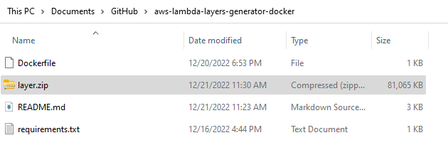

# Python Layer Generator for Lambda Aws using Docker

This repos allows you to generate **python** Layers for [lambda in AWS](https://aws.amazon.com/lambda/).

Lambda is an amazing AWS Service allowing you to develop serverless functions.

There is a full detailed tutorial on medium on how to use this repo: [Link to Medium Tutorial](link to it)

# Pre-Requisites

You must have Docker Installed. You can get Docker following this link: [Get Docker](https://docs.docker.com/get-docker/)

# How to install the Lambda Layer Generator

1. Clone this repository
2. Build the Docker Image which will be used you to build the layer

By default the python version installed in the docker image is **3.7.12**, but you can change it using the Docker Arg **python_version**

In the following example, the *python 3.7.12* is used.

(Available python versions can be seen at [Python Versions](https://www.python.org/ftp/python/))
```
git clone https://github.com/LeoCyclope/aws-python-lambda-layers-generator-docker.git
cd aws-python-lambda-layers-generator-docker
docker build --build-arg python_version=3.7.12 . -t aws-lambda-layer-generator
```

# How to Customize

- **Update the requirements.txt with the libraries you want your layer to contain.**
    - By the default the current requirements.txt will install *Opencv* and *Pillow*.
- Change the python version according to the runtime used in lambda:
    - You can change the **python_version** docker ARG when building you Dockerfile to match the runtime. 
- When Executing, change the python lib folder path to match the runtime you chose in Lambda AWS.
    - Ex: python/lib/python**3.7**/site-packages/ should be changed to python/lib/python**3.8**/site-packages/ if you chose the runtime 3.8


# How to Execute

## On Windows

```
docker run --rm -v ${PWD}:/workdir aws-lambda-layer-generator /bin/bash -c "mkdir layer && cd layer && pip install -r /workdir/requirements.txt -t python/lib/python3.7/site-packages/ && zip -r layer.zip * && cp layer.zip /workdir"
```

*(Change the export path to match the runtime version you chose : python/lib/python**3.7**/site-packages/)*


## On Linux

```
docker run --rm -v $pwd:/workdir aws-lambda-layer-generator /bin/bash -c "mkdir layer && cd layer && pip install -r /workdir/requirements.txt -t python/lib/python3.7/site-packages/ && zip -r layer.zip * && cp layer.zip /workdir"
```

*(Change the export path to match the runtime version you chose : python/lib/python**3.7**/site-packages/)*


## Output

The output of the command lines above will me a .zip called **"layer.zip"** which will is the file required to build your layer.




# How to create the layer.

There is a full detailed tutorial on medium on how to use this repo: [Link to Medium Tutorial](https://medium.com/@souquet.leo/how-to-integrate-external-custom-python-libraries-in-aws-lambda-using-layer-and-a-layer-generator-b0981bf338fb)

# Sources

Thanks to this repo which helped me generalize my docker file: (https://github.com/awslabs/lambda-opencv)